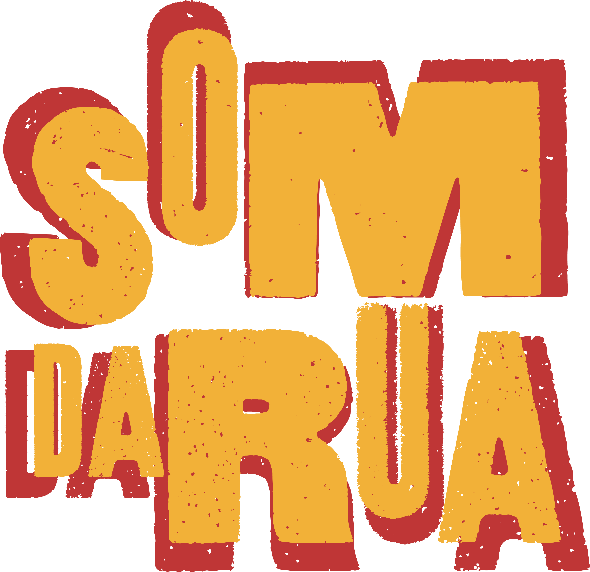

<p align="center">
    
</p>


## URL 
https://somdaruasalvador.com.br/

## Sobre o projeto

Som da rua é um projeto realizado pela turma de 2024.26.12 - Programador Fullstack do SENAC (Serviço Nacional de Aprendizagem Comercial). Esse é um site cuja a finalidade é catalogar eventos que acontecerão na nossa cidade - Salvador, Bahia - principamente para turistas terem a informação de maneira rápida e fácil. Além disso, donos de estabelecimentos como bares e casas de evento podem cadastrar livremente eventos que irão acontecer em seus espaços.

## Requerimentos
Esse projeto precisa de alguns softwares para rodar localmente
- [Composer](https://getcomposer.org/download/)
- [Algum servidor HTTP como o XAMPP](https://www.apachefriends.org/pt_br/index.html)
- [Node.js](https://nodejs.org/pt)

## Instalação
Após clonar o projeto, deve-se iniciar o banco de dados MySQL e criar um arquivo .env baseado no .env.example, e após isso, rodar os seguintes comandos na raiz do projeto:
```
npm install
php artisan migrate:fresh
php artisan db:seed
php artisan key:generate
npm run dev
```
E por fim, para iniciar o servidor local:
```
php artisan serve
```
